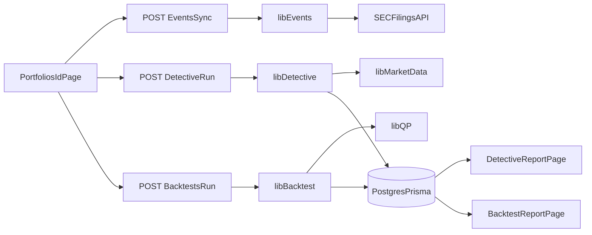

# Quant Risk Snapshot

A small, self-contained portfolio risk analytics web app built with **Next.js 14 (App Router) + TypeScript + Recharts**.

Enter a portfolio (tickers + shares or weights), pull daily price history from Yahoo Finance (no API key needed), and get a professional risk report with optional rebalancing. Saved portfolios are **private per user**: sign in with username/password (built-in), and optionally with GitHub/Google if configured.

---

## Assignment alignment

This project was built to satisfy a backend-focused assignment (server-side logic, deployment, frontend integration, documentation). Here’s how it maps:

- **Backend** — Implemented as Next.js API routes (App Router). The backend:
  - **Accepts data and returns meaningful responses**: portfolio CRUD, snapshot creation, price fetching, alert rules; all return JSON.
  - **Uses server-side logic**: authentication (NextAuth + GitHub), snapshot computation (returns, vol, drawdown, VaR, etc.), secure price fetching (no keys in the frontend), and persistence (PostgreSQL via Prisma).
  - **Stores secrets in the environment**: `DATABASE_URL`, `NEXTAUTH_SECRET`, `GITHUB_ID`, `GITHUB_SECRET` are read from env only; no secrets in the repo or frontend.
  - **Returns JSON** (or CSV for export) for the frontend to consume.
- **Deployment** — Deployed to **Vercel** (not Render). The app gets a public URL (e.g. `https://quant-risk-snapshot.vercel.app`). Database is hosted PostgreSQL (e.g. Neon); migrations run on deploy.
- **Frontend** — Next.js pages use `fetch()` to call the backend, render results (tables, charts, forms), and handle errors (e.g. 401 redirect to sign-in, 4xx/5xx messages).
- **Documentation** — This README describes what the backend does, how to run locally, how the frontend calls it, and where secrets live.

---

## Privacy & authentication

- **Portfolios are private.** Each portfolio is stored with a `userId` (your GitHub id). The API only lists, returns, updates, or deletes portfolios that belong to the currently signed-in user. No one else can see or change your portfolios.
- **Sign in is required** to use the Portfolios feature (`/portfolios`, `/portfolios/new`, `/portfolios/[id]`, `/snapshots/[snapshotId]`). Username/password is always available; GitHub/Google are optional providers. Unauthenticated requests to those APIs return 401; the UI redirects to a sign-in page and back after auth.
- The rest of the app (Input, Report, Rebalance) does not require sign-in and does not store user-specific data.

---

## Pages

| Route | Description |
|---|---|
| `/` | Portfolio input form (tickers, weights/shares, range, benchmark, shrinkage) |
| `/report` | Risk snapshot dashboard with charts and exports |
| `/rebalance` | Min-variance or risk-parity rebalancer with turnover slider |
| `/portfolios` | Persistent portfolio monitor list (database-backed) |
| `/portfolios/new` | Create saved portfolio with defaults |
| `/portfolios/[id]` | Portfolio detail, run snapshot, detective, backtests, alerts |
| `/snapshots/[snapshotId]` | Snapshot report loaded from database |
| `/detective/reports/[reportId]` | Portfolio Detective report (drivers + ranked events) |
| `/backtests/[backtestId]` | Backtest report (equity curve + metrics + rebalance weights) |

---

## API

### `GET /api/prices`

Server-side route that fetches daily adjusted close prices from Yahoo Finance (free, no key), caches them, and aligns dates.

**Query parameters**

| Param | Type | Default | Description |
|---|---|---|---|
| `tickers` | string | (required) | Comma-separated tickers, e.g. `AAPL,MSFT,SPY` |
| `range` | string | `1y` | One of `3m`, `6m`, `1y`, `3y` |

**Response**

```json
{
  "range": "1y",
  "start": "2025-02-07",
  "end": "2026-02-07",
  "dates": ["2025-02-07", "2025-02-10", "..."],
  "pricesByTicker": {
    "AAPL": [185.23, 186.01, "..."],
    "MSFT": [410.50, 411.20, "..."]
  },
  "errors": { "BAD": "Invalid symbol BAD: ..." }
}
```

- The `errors` field is only present when some tickers failed (partial success).
- All market data requests are server-side to keep the API key hidden.
- In-memory cache with 6-hour TTL per `ticker:start:end` key.
- Exponential backoff (up to 3 retries) on rate-limit / transient errors.
- Uses Yahoo Finance (no API key required, adjusted close available).

### Portfolio Monitor APIs

**All of these require an authenticated session (sign in with GitHub).** Responses are scoped to the signed-in user’s portfolios only.

#### Portfolios
- `POST /api/portfolios` create a portfolio with holdings/defaults (owned by current user)
- `GET /api/portfolios` list the current user’s portfolios with derived summary fields
- `GET /api/portfolios/:id` get detail, holdings, defaults, latest snapshot (404 if not owner)
- `PATCH /api/portfolios/:id` update name/defaults/holdings (404 if not owner)
- `DELETE /api/portfolios/:id` delete portfolio (404 if not owner; cascade deletes related records)

#### Snapshots
- `POST /api/portfolios/:id/snapshots` run server-side snapshot and persist results
- `GET /api/portfolios/:id/snapshots` list snapshot history
- `GET /api/snapshots/:snapshotId` full snapshot detail payload
- `GET /api/snapshots/:snapshotId/export?fmt=json|csv` export endpoint

#### Events + Portfolio Detective
- `POST /api/portfolios/:id/events/sync` sync SEC filings for portfolio tickers
- `GET /api/portfolios/:id/events?type=&ticker=&limit=&cursor=` list stored events for a portfolio
- `POST /api/portfolios/:id/detective/run` run detective scoring for an analyze date/window
- `GET /api/portfolios/:id/detective/reports` list detective report summaries
- `GET /api/detective/reports/:reportId` full detective payload (summary, drivers, ranked events + reaction stats)

#### Backtests
- `POST /api/portfolios/:id/backtests/run` run a periodic rebalance backtest and persist output
- `GET /api/portfolios/:id/backtests` list backtest runs for a portfolio
- `GET /api/backtests/:backtestId` full backtest payload

#### Alerts (bonus)
- `POST /api/portfolios/:id/alerts` create alert rule (`vol_gt`, `maxdd_lt`, `var_gt`)
- `GET /api/portfolios/:id/alerts` list alert rules
- `POST /api/portfolios/:id/alerts/check` evaluate rules against latest snapshot

---

## Risk Metrics — Methodology

### Returns

Daily simple returns: `r_i[t] = P_i[t] / P_i[t-1] - 1`

Portfolio returns: `r_p[t] = sum(w_i * r_i[t])` with weights fixed at last-day values.

### Performance

| Metric | Formula |
|---|---|
| Total Return | `prod(1 + r_p[t]) - 1` |
| CAGR | `(1 + totalReturn)^(252/n) - 1` |
| Annualized Vol | `std(r_p) * sqrt(252)` |
| Sharpe | `(mean(r_p)*252 - rf) / vol` |
| Max Drawdown | `max(1 - E[t]/peak[t])` where `E` is equity curve |

### Beta

`beta = Cov(r_p, r_b) / Var(r_b)` using the selected benchmark.

### Covariance / Correlation

Sample covariance matrix with optional shrinkage:

`covShrink[i][j] = (1-lambda) * cov[i][j]` for off-diagonal entries (diagonal unchanged).

### VaR / CVaR (Historical)

- **VaR 95%** = negated 5th percentile of daily returns
- **CVaR 95%** = negated mean of returns at or below VaR

### Concentration

- **HHI** = `sum(w_i^2)`
- **Effective N** = `1 / HHI`

### Risk Contributions

Marginal contribution: `m = (Sigma * w) / sigma_p`

Risk contribution: `RC_i = w_i * m_i`

Percent: `RC_i / sigma_p` (displayed as bar chart)

---

## Rebalancer

### Min-Variance (QP constraints)

Min-variance weights are solved with a quadratic program:
- objective: minimize `w^T Sigma w`
- constraints: `sum(w)=1`, `w_i >= 0`, optional `w_i <= maxWeight`

The app uses a QP solver path by default (toggle available on `/rebalance`).

### Risk Parity (Iterative)

Target: equal risk contributions across all assets.

Algorithm (200 iterations):
1. Initialize `w = equal weights`
2. Compute `RC_i`
3. Update `w_i = w_i * (targetRC / RC_i)^eta` with `eta = 0.5`
4. Clamp and normalize

### Turnover Control

`wFinal = (1 - gamma) * wCurrent + gamma * wTarget`

Gamma slider ranges from 0 (keep current) to 1 (full rebalance).

### Trades (shares mode only)

- `totalValue = sum(q_i * P_i_last)`
- `targetShares_i = floor(totalValue * wFinal_i / P_i_last)`
- `tradeShares = targetShares - currentShares`
- Cash leftover shown

---

## Limitations

- **Daily bars only** — no intraday data
- **Survivorship bias** — only currently listed tickers
- **Static weights** — portfolio returns use last-day weights, not daily rebalanced
- **No slippage model** — backtests support transaction cost in bps, but no market-impact/slippage model yet
- **Covariance instability** — sample covariance can be noisy for small windows; shrinkage toggle helps
- **Corporate actions** — uses Yahoo Finance adjusted close (accounts for splits/dividends)
- **Rate limits** — Yahoo Finance is unofficial; caching and retries handle transient issues
- **Event ingestion scope** — MVP uses SEC filings first; earnings/news connectors are still optional

---

## Project Structure

The codebase is organized so **frontend** (pages, UI) and **backend** (API routes) are clearly separated.

### Cleanup Program (2026)

- Feature-oriented backend slices now live in `features/`.
- Shared auth/ownership guards and API error helpers live in `features/shared/`.
- Route-specific frontend hooks/components are colocated near their pages.
- Repo standards and architecture notes were consolidated into `docs/`.

See:
- `docs/architecture.md`
- `docs/repository-conventions.md`
- `docs/cleanup-checklist.md`

### Frontend (UI and pages)

- **`app/(frontend)/`** — All user-facing routes (Next.js route group; URLs are unchanged).
  - `page.tsx` → `/` (input form)
  - `report/page.tsx` → `/report` (risk dashboard)
  - `rebalance/page.tsx` → `/rebalance` (rebalancer)
  - `portfolios/page.tsx` → `/portfolios` (portfolio list)
  - `portfolios/new/page.tsx` → `/portfolios/new`
  - `portfolios/[id]/page.tsx` → `/portfolios/[id]` (detail + snapshot + detective + backtests)
  - `snapshots/[snapshotId]/page.tsx` → `/snapshots/[snapshotId]` (stored snapshot report)
  - `detective/reports/[reportId]/page.tsx` → `/detective/reports/[reportId]`
  - `backtests/[backtestId]/page.tsx` → `/backtests/[backtestId]`
  - `auth/signin/page.tsx` → `/auth/signin`
- **`app/layout.tsx`** — Root layout (nav, session provider, global styles).
- **`components/`** — Reusable UI: `MetricCard`, `LineChartCard`, `BarChartCard`, `CorrHeatmap`, `SiteHeader`, `SessionProvider`.

### Backend (API and server logic)

- **`app/api/`** — All API routes (backend).
  - `auth/[...nextauth]/route.ts` — NextAuth session providers
  - `auth/signup/route.ts` — Username/password sign-up
  - `prices/route.ts` — Server-side price API (Yahoo Finance)
  - `portfolios/route.ts`, `portfolios/[id]/route.ts` — Portfolio CRUD
  - `portfolios/[id]/snapshots/route.ts` — Run/list snapshots
  - `portfolios/[id]/events/route.ts`, `portfolios/[id]/events/sync/route.ts` — Event ingestion/listing
  - `portfolios/[id]/detective/run/route.ts`, `portfolios/[id]/detective/reports/route.ts` — Detective runs/list
  - `detective/reports/[reportId]/route.ts` — Detective detail
  - `portfolios/[id]/backtests/run/route.ts`, `portfolios/[id]/backtests/route.ts` — Backtest run/list
  - `backtests/[backtestId]/route.ts` — Backtest detail
  - `portfolios/[id]/alerts/route.ts`, `portfolios/[id]/alerts/check/route.ts` — Alert rules
  - `snapshots/[snapshotId]/route.ts`, `snapshots/[snapshotId]/export/route.ts` — Snapshot detail and export
- **`lib/`** — Shared and server-side logic:
  - **Used by API:** `auth.ts`, `db.ts`, `marketData.ts`, `snapshot.ts`, `events.ts`, `detective.ts`, `backtest.ts`
  - **Shared (UI + API):** `math.ts`, `rebalance.ts`, `qp.ts`, `types.ts`, `utils.ts`
- **`prisma/`** — `schema.prisma` and migrations (PostgreSQL).

---

## Architecture (updated)



## Learning since start of semester

- **API + ownership checks**: every user-scoped API validates session (`401`) and ownership (`404`) before returning data; this keeps private portfolio data isolated.
- **DB modeling**: moved from single snapshot entities into richer report tables (`Event`, `EventImpact`, `DetectiveReport`, `BacktestRun`) with JSON payloads for fast iteration and relational keys for ownership.
- **Caching/rate-limits**: reused server-side market cache and added SEC request pacing + retries to reduce transient failure impact.
- **Analytics sanity checks**: type-checking and deterministic formulas (returns, drawdown, abnormal returns, turnover/cost accounting) were used as a baseline validation layer before UI wiring.

## Future Work

- Factor model exposures (Fama-French FF3/FF5)
- Live alerts/watchlist and scheduled checks
- Intraday data support (1m/5m)
- ML-assisted detective ranking (after enough labeled event outcomes)
